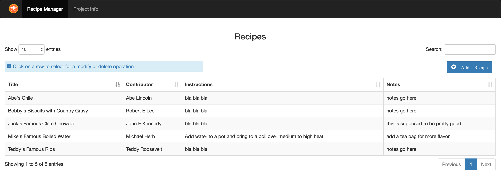

### Recipe Manager

##### This is a simple Spring Boot project which was built to demonstrate Spring Boot, Spring Data Mongo, @RestController, and Project Lombok.  
Go to http://localhost:8080/ to see the UI
Go to http://localhost:8080/swagger-ui.html to see Swagger UI

#####  Prerequsites
1.  Mongo Database.  Installation instructions can be found [here](https://docs.mongodb.com/manual/installation/#mongodb-community-edition)
2.  Postman.  Makes it easy to test Rest Endpoints.  Get it [here](https://www.getpostman.com/)
3.  Robo 3T - a Mongo Database Gui.  Explore your Mongo DBs and Collections with a nice GUI.  Get it [here](https://robomongo.org/download)

#####  Reference Information
1.  Spring Boot - [here](http://spring.io/projects/spring-boot)
2.  Spring @RestController Annotation and Benefits - [here](https://www.baeldung.com/spring-controller-vs-restcontroller)
3.  Spring Data Mongo - [here](http://spring.io/projects/spring-data-mongodb)
4.  Other Spring Data Projects (lots of databases supported) - [here](https://spring.io/projects/spring-data)
5.  Project Lombok - [here](https://projectlombok.org/)
6.  Learn more about deploying Spring Boot microservices in an private or public cloud infrastructure using Pivotal Cloud Foundry - [here](https://pivotal.io/learn)